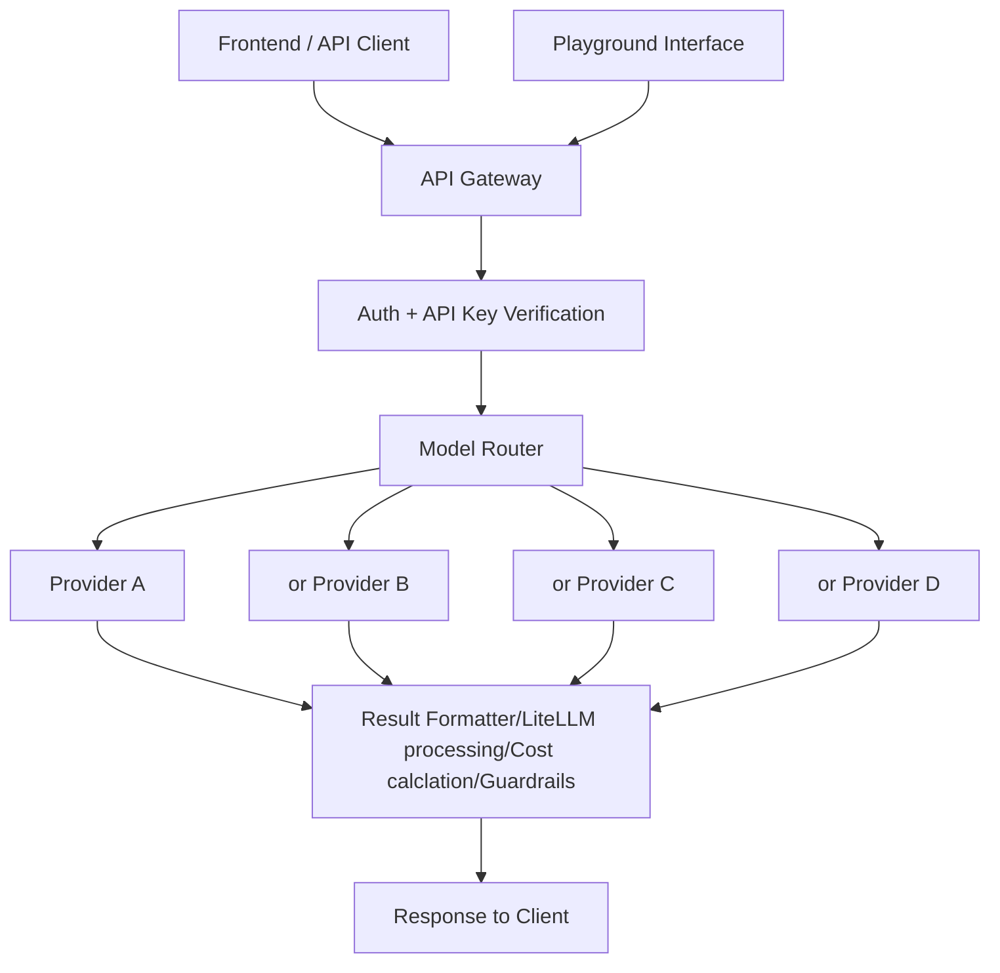

 

## What is Model Market?
Model Market is an all-in-one AI model execution platform that lets developers generate text, images, audio, video, and code using a single, simplified API.
It abstracts multiple AI providers behind one consistent interface, handles cost tracking, and provides a fast playground to experiment with models visually.

## How Model Market Works

<Steps>
  <Step title="User Authentication">
    Users sign up and receive an API key from their profile. This key allows them to access the Model Market API securely.
  </Step>

  <Step title="Model Selection">
    Choose from text, vision, audio, video, or code-generation models powered by providers like OpenAI, Replicate, Together AI, etc.
  </Step>

  <Step title="Unified Request Format">
    You send a generation request to a single endpoint ```/v1/mmk-generate``` regardless of the model type.
  </Step>

  <Step title="Query Processing">
    When you query, your question is embedded and matched against stored documents.
  </Step>

  <Step title="Model Execution">
    Model Market routes the request to the correct provider, executes the model, and handles retries, formatting, and cost measurement.
  </Step>

  <Step title="Result Delivery">
    The API returns well-structured output including model results, provider details, usage cost, URLs (for media), and timestamps.
  </Step>
</Steps>

## Core Components

### Model Groups
Model groups categorize models by their output type:
- Video Generation
- Audio / TTS
- Code Generation
- Image Generation
- Avatar Generation
- LLMs / Language Models

Each group contains multiple models with different capabilities, speeds, and costs.

### Playground

The Playground is an interactive environment where users can:

* Test any model instantly
* Modify parameters
* Compare outputs
* View cost estimations
* Export request payloads for API use
  
This lets developers experiment visually before integrating anything into their applications.

### The Unified API

Model Market offers one consistent API endpoint:

```
POST /v1/mmk-generate
```
This endpoint intelligently handles all model types using a flexible schema.
You need to specify:
- [x] type — "text" | "image" | "video" | "audio" | "code"
- [x] model — provider model name
- [x] input — prompt or instructions
- [x] Optional settings like width, height, duration, style, etc.

Similar format, every model, unified response.

## Generation Flow

<Columns cols={2}>
  <Card title="Request Preparation" icon="lightbulb">
    The client sends a JSON body describing the model type, model name, and input prompt.
  </Card>

  <Card title="Provider Routing" icon="settings">
    The request is automatically matched to the correct backend provider
  </Card>

  <Card title="Execution & Monitoring" icon="proportions">
    Model Market handles provider authentication, queueing, timeout handling, retries, cost calculation, [LiteLLM](https://www.litellm.ai/) based unified response.
  </Card>

  <Card title="Structured Output" icon="cloud">
    Use our api service to get the unified response with handling cost calculation, guardrail services, tasks history and user authenticated keys.
  </Card>
</Columns>

## Key Features

### Unified Model API

Access multiple models, choose the best and use one endpoint and one request structure for your use case.

### Transparent Pricing

Each response includes exact cost calculations for clear usage tracking.

### Developer-Friendly Playground

Experiment with models visually and export API-ready code.

### Multi-Modal Support

Generate text, images, audio, video, and code without switching tools.

## Use Cases
### Content Creation
Quickly generate blog text, artwork, social media posts, scripts, summaries, or automated content pipelines.
#### Benefits:
- Multi-modal (text, image, audio, video)
- Fast experimentation
- Consistent API for all media types

### Audio & Voice Tools
Generate high-quality TTS audio or voiceovers for videos, tutorials, or applications.
#### Benefits:
- Supports multiple TTS engines
- Fast processing
- Direct audio URLs in responses

### AI SaaS Applications
Use Model Market as the backend for your own code, convert languages, or generate scripts, content. For applications like AI video generators, AI chatbots, AI image editors, Script generators, Media editing tools.

#### Benefits:
- No need to manage multiple provider APIs
- Less overhead
- Predictable billing




## Getting Started

<Card title="Quick Start" icon="rocket" href="/quickstart">
  Learn how to authenticate, call your first model, and integrate the API.
</Card>

<Card title="API Reference" icon="book" href="/api-reference/introduction">
  Explore all parameters, schemas, and model types documentation.
</Card>

<Card title="Try the Playground" icon="globe" href="https://modelmarket.allcognix.com/playground">
  Experiment with multi-modal generation instantly.
</Card>